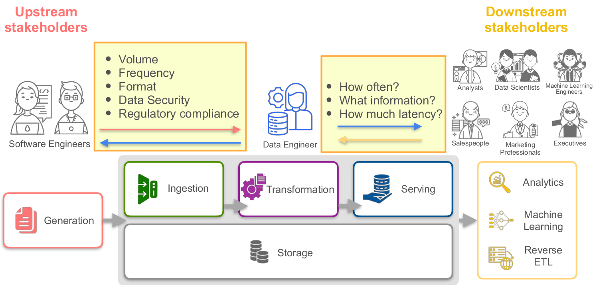

## Notes for week 1

1\. Content in this week:

Get a basic understanding of the data engineering process and how it helps businesses. Start learning how data engineers think, beginning with understanding what stakeholders need and turning those needs into system requirements. Learn the basics of working with cloud services from an AWS expert.

+ Identify key upstream and downstream collaborators and stakeholders for data engineers:

