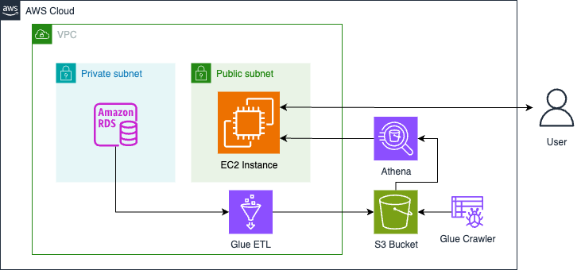

# Web Application Scalability and Performance Lab

## Aim
The aim of this lab is to ensure that your web application can handle an increasing number of users (scalability), use resources efficiently, and remain secure and reliable. You'll be working with Amazon Web Services (AWS) tools and services to achieve these goals.

## Steps

1. **Understand the Architecture**
   - Your web application is built on a three-tier architecture: 
     1. **Data Tier** (S3 Bucket): Where your data is stored.
     2. **Logic Tier** (EC2 Instances and Load Balancer): Where the application logic processes client requests.
     3. **Presentation Tier**: Where the results are displayed to clients.

2. **Auto Scaling and Load Balancing**
   - **Auto Scaling Group**: A group of EC2 instances that can increase or decrease in number based on demand. This ensures your application can handle more traffic when needed and saves costs when the load is low.
   - **Application Load Balancer (ALB)**: Distributes incoming traffic across your EC2 instances to ensure no single instance is overloaded and provides a single point of contact for clients.

3. **Simulate Traffic and Monitor Performance**
   - Generate traffic to your web application to test its scalability.
   - Use **Amazon CloudWatch** to monitor the performance of your application, including computing resources and network activity.

4. **Optimize Performance and Costs**
   - Configure your EC2 instances for performance efficiency and cost optimization. This might involve selecting the right instance types, adjusting instance sizes, or using spot instances.

5. **Enhance Security**
   - Adjust the security settings of the load balancer to control incoming traffic. This may include setting up security groups, configuring firewall rules, or using SSL certificates for secure connections.

<link rel="stylesheet" href="style.css">
<h1>Week 3 Assignment: Good Data Architecture</h1>

Welcome to week 3 lab! In this lab, you will explore and assess the security, performance, reliability, and scalability aspects of a 
web application hosted on AWS. You will do this by simulating traffic to your web application and using AWS tools such as Amazon CloudWatch 
to monitor computing resources and network activity on your web application. 
You will configure the computing resources to enable performance efficiency, as well as security options to control the in-bound 
traffic to your web application. You will perform these tasks through the principles of “good” data architecture as well as the lenses of AWS Well-Architected Framework.
By going through this lab, you will gain an understanding of the primitive resources available on AWS, so that you can later apply 
this understanding when you architect your data pipelines as a Data Engineer.

<ul>
<li><a href="#1">1 - Lab Setup</a></li>
<li><a href="#2">2 - Introduction</a></li>
<li><a href="#3">3 - Getting the Address of the Web Application</a></li>
<li><a href="#4">4 - Monitoring CPU Usage and Networking Activity</a></li>
<li><a href="#5">5 - Enhancing Security</a></li>
<li><a href="#6">6 - Checking EC2 Availability</a></li>
<li><a href="#7">7 - Performing Auto Scaling</a><ul>
<li><a href="#7.1">7.1 - Using Resources Efficiently</a></li>
<li><a href="#7.2">7.2 - Performing Auto Scaling</a></li>
</ul>
</li>
<li><a href="#8">8 - Lab Submission</a></li>
</ul>

<h2>1 - Lab Setup</h2>

<em>Notes</em>: 

<ul>
<li>For the lab, it is better to use a laptop or desktop computer instead of a tablet.</li>
<li>The lab uses Amazon Web Services (AWS) which takes some time to spin up. You may need to wait a few minutes for the lab to open.</li>
</ul>

1.1. Click on  button (upper right of the screen) to begin the lab. Wait until the  link (top left of the screen) will have a green sign next to it. 
<em>Note:</em> On the first start of the lab, the lab environment should load in a few seconds, but subsequent attempts may take up to 5 minutes.

<h2>2 - Introduction</h2>

In week 2, you implemented a data pipeline where you ingested and transformed data and then served it to a data analyst.

Assume now you built a similar data pipeline to serve the transformed data to a broader public. For example, assume your company sells some analytical
data and makes it available to people across the internet. Or, assume it needs to serve some embedded dashboards to its clients. To do so, you will need 
to build a web application that makes the data or dashboards available to their intended clients and that is capable of scaling to their needs. In this lab, 
you will focus on this component of your data architecture (the web app) to assess its security, performance, reliability, and scalability.

How is the web application created? A typical way of deploying web application solutions is to use a <a href="https://docs.aws.amazon.com/whitepapers/latest/serverless-multi-tier-architectures-api-gateway-lambda/three-tier-architecture-overview.html">three-tier-architecture</a> that consists of three tiers or layers:

<ul>
<li><strong>Presentation tier</strong>: this tier represents the user interface of the website (ex.: a web page) that allows clients to interact with the web application using 
their devices. This is where you can display the analytical dashboards for clients.</li>
<li><strong>Logic tier</strong>: this tier, also known as the application tier, represents the business logic that processes clients' input, queries the internal data stores and 
returns the results that need to be displayed on the presentation layer.</li>
<li><strong>Data tier</strong>: this tier is where the data associated with the web application is stored.</li>
</ul>

Here the three-tier architecture of your web application is given to you, and you’ll mainly interact with the computing resources on which the application logic is run. Here’s the architectural diagram of the web application:

On the left side, you see S3 which represents the data store of the data layer, just as an example of a data tier. On the right side, you see the clients 
that interact with the website through their devices. The other two main components are <strong>Application Load Balancer (ALB)</strong> and <strong>Auto Scaling group</strong> which 
both operate at the application layer:

<ul>
<li>

<a href="https://docs.aws.amazon.com/autoscaling/ec2/userguide/what-is-amazon-ec2-auto-scaling.html">Amazon EC2 Auto Scaling group</a>: this group consists of a 
collection of EC2 instances. What is an EC2 instance? This is the application server on which your application logic runs. It mainly consists of 
Central Processing Unit (CPU) and Random Access Memory (RAM). Think of EC2 as a computer that is provided by AWS on which you will run your code. 
Now why do you have more than one EC2? Each EC2 runs the same logic and they are used to increase the computing capabilities of your application. 
So instead of having a single EC2 that processes all inputs or requests from clients, these inputs are distributed across the EC2 instances. 
<strong>Auto-scaling</strong> means that the number of EC2 instances can increase or decrease based on the demand. In this case it is the client’s inputs or requests to the web app.

</li>
<li>

<a href="https://docs.aws.amazon.com/elasticloadbalancing/latest/userguide/what-is-load-balancing.html">Application Load Balancer</a>: The Auto Scaling group is associated 
with an application load balancer, which distributes incoming application traffic (clients requests’ or inputs) across the EC2 instances. The load balancer serves as the single point of contact for clients.

</li>
</ul>

In the diagram, you also see two terms: <strong>Virtual Private Cloud (VPC)</strong> and <strong>subnet</strong>. VPC is a way to isolate your resources (for example EC2) from the outside world. 
Think about it as a box or a wall that protects your resources, and also as a way to organize them. Resources within the VPC can communicate with each other. 
But by default, there’s no communication between the VPC and the internet outside unless you allow for this communication to happen by properly configuring the VPC. 
Now inside your VPC, you may need some resources to be public and some others to be private. How can you do that? This is the role of subnets that you can create within your VPC. 
Subnets provide you with more detailed control over access to your resources. You can create a <strong>public subnet</strong> if you want to allow for outside traffic to access your resources, 
and you can create a <strong>private subnet</strong> if you don’t want to allow for outside traffic to access your resources.

<h2>3 - Getting the Address of the Web Application</h2>

The architecture of the web application is implemented and provided to you in this lab. Your first task is to get the address of your web application. To do so, you need to find the ALB, since it serves as the single point of contact for clients.

3.1. When the lab environment is ready, the AWS link will change to green:  (top left of the screen). Click on the AWS link, it will open AWS Management Console in a new tab. Then you can return to this tab to find the remaining instructions. 
<em>Note:</em> If you see the window like in the following printscreen, click on <strong>logout</strong> link, close the window and click on  link again.

3.2. To find the Application Load Balancer (ALB) that has been created as part of your application architecture, go to the AWS console and search for <strong>EC2</strong>.

3.3. In the left panel click on <strong>Load Balancers</strong> (bottom of the panel) 

3.4. You will see a load balancer called <code>de-c1w3-alb</code>. Copy the <code>DNS Name</code> field. DNS stands for Domain Name System which translates domain name like example.com into an IP address 
(you can read more about DNS <a href="https://aws.amazon.com/route53/what-is-dns/">here</a>).

3.5. Open a new browser window and paste the DNS Name. You will see the following message displayed on the web page:

The web page should display a dashboard for clients, but for brevity and simplicity's sake, you are shown a simple message. Don't worry about the details of this message, 
you will explore them in a later section of this lab. By having opened the webpage, you sent an HTTP request to the ALB. The HTTP request reached the ALB through port 80, 
which is the <a href="https://www.techopedia.com/definition/15709/port-80#:~:text=To%20make%20it%20convenient%20for,Port%2080%20should%20be%20used">default port</a> for HTTP requests 
(if you don’t know what port means, check <a href="https://www.cloudflare.com/learning/network-layer/what-is-a-computer-port/">here</a>).

In the next sections, you will learn how to monitor the computing and networking activity of your web app and you will ensure that the principles of “good” data architecture are in place. 
In particular, you will configure your architecture to embrace the following principles: “Prioritize security”, “Plan for failure” , and “Architect for scalability”.

<h2>4 - Monitoring CPU Usage and Networking Activity</h2>

When you share your web app with your clients, you should expect some incoming traffic to your application that needs to be processed. To ensure that your application 
can support the incoming demands, you would need to monitor the usage of computing resources of your web-app. To do so, you can use Amazon CloudWatch, which is the monitoring 
and observability service in AWS that enables you to collect and track computing and memory metrics for your web app.

Monitoring the usage of computing resources of your web-app is one of the practices of the undercurrent DataOps and the Operational Excellence pillar of 
<a href="https://aws.amazon.com/architecture/well-architected/?wa-lens-whitepapers.sort-by=item.additionalFields.sortDate&amp;wa-lens-whitepapers.sort-order=desc&amp;wa-guidance-whitepapers.sort-by=item.additionalFields.sortDate&amp;wa-guidance-whitepapers.sort-order=desc">AWS Well-Architected Framework</a>. 
These practices emphasize the importance of integrating automation, monitoring of systems, and adaptability into the design of cloud workloads. These practices enable your understanding 
of your workloads and their anticipated behaviors.

In this section, you are going to perform some stress tests to simulate traffic to your website and then monitor CPU usage and networking activity using Amazon CloudWatch.

4.1. To perform stress tests over your current architecture, you will use an open-source benchmarking tool called <a href="https://httpd.apache.org/docs/2.4/programs/ab.html">Apache Benchmark</a>. 
This tool is used to test the ability of a website to handle a large number of HTTP requests at the same time.

In the AWS console, search for the <strong>CloudShell</strong> service:

AWS CloudShell is a browser-based shell that makes it easier to securely manage, explore, and interact with your AWS resources.

4.2. Install the Apache Benchmark tool with the terminal command (the option <code>-y</code> allows to automatically confirm the package installation without manual intervention):

<pre><code class="language-bash">sudo yum install httpd-tools -y</code></pre>

4.3. To generate a stress test over your server you will need to make multiple HTTP GET requests with some concurrency meaning, the requests run at the same time. 
This can be done with the <code>ab</code> command of Apache Benchmark. 
Run the following command, replacing <code>ALB-DNS</code> with the <code>DNS Name</code> of your ALB (it should be in the address of the browser window where you saw the dashboard representation).

<pre><code class="language-bash">ab -n 7000 -c 50 http://&lt;ALB-DNS&gt;/</code></pre>

Make sure you add the <code>/</code> path at the end of it. The options used in the command are used for the following purposes:

<ul>
<li>Option <code>-n</code> corresponds to the total number of requests that will be sent to the HTTP server.</li>
<li>Option <code>-c</code> corresponds to the number of concurrent (simultaneous) requests that will be done.</li>
</ul>

4.4. To monitor the CPU and networking usage, go to the <strong>Auto Scaling Groups</strong> in the AWS console (it is a part of the EC2 section):

4.5. Select the Auto Scaling group created for you and select the <strong>Monitoring</strong> tab and then click on <strong>EC2</strong>:

There you can see some of the available metrics that are measured which include CPU, Networking (inbound and outbound), among others. 
During the test, you can check the CPU and Networking graphs to see an increase in the metrics; the graph updates can take some time as metrics in AWS CloudWatch have a 5-10 minute latency. 
You will need to click on  button to see the updates.
There are other available metrics and the possibility of defining new ones through AWS CloudWatch.

AWS CloudWatch is the monitoring and observability service in AWS that enables users to collect and track metrics, collect and monitor log files, and set alarms. 
It is designed to provide a comprehensive view of the AWS resources, applications, and services running in the AWS infrastructure.

After all requests are performed, you should notice a reduction in the CPU activity as well as in the networking.

<h2>5 - Enhancing Security</h2>

Now that you know how to monitor the computing resources of your application, it’s time for you to delve into the security aspect of your servers. Security should always be your priority as stated 
in the principle “prioritize security”. Also, the security pillar provides insights into how to leverage cloud technologies to secure data, systems, and assets, and to protect them from unauthorized access.

You were told that through port 90 of the ALB some private data is displayed, but only certain people inside your company should have access to it. In this section, you will fix this issue so that any inbound 
traffic is only allowed to go through port 80. In particular, you will work with adjusting the <strong>security groups</strong> of the ALB, which is a tool that acts as a virtual firewall, controlling inbound and outbound 
traffic through the ALB.

5.1. Take the <code>DNS Name</code> of your ALB and paste it into your browser search bar pointing to the port 90, as follows:

<pre><code>&lt;ALB-DNS&gt;:90</code></pre>

Through this port, you see a message that mimics the display of some private data. You are surprised given the security requirements that should have been implemented, 
so you decide to fix it now. 

5.2. In the AWS console, again you search for <strong>EC2</strong> and then click on <strong>Security Groups</strong> in the left panel. 

You will see a list of security groups, out of which you will work with the following ones: 

<ul>
<li><code>de-c1w3-ec2-sg</code>: This is the security group of your EC2 instances (servers).</li>
<li><code>de-c1w3-alb-sg</code>: This is the security group of the Load Balancer.</li>
</ul>

5.3. Click on the id for the security group with the name <code>de-c1w3-ec2-sg</code>. In the <strong>Inbound Rules</strong> section, you will find the following rule:

<ul>
<li>Rule with <code>Type: All TCP</code>, <code>Port range: 0-65535</code> and as source a security group id. This source is the security group of the ALB. The purpose of this security group is to ensure that servers will only receive traffic from the ALB.</li>
</ul>

5.4. Go back and click on the ID for the <code>de-c1w3-alb-sg</code> security group. Check the <strong>Inbound Rules</strong> to find the following rule:

<ul>
<li>Rule with <code>Type: All TCP</code>, <code>Port range: 0-65535</code> and <code>Source: 0.0.0.0/0</code> (which means all IP addresses). This rule means that any source can access the ALB using any port, which is quite open and insecure!</li>
</ul>

5.5. Now, click on <strong>Edit inbound rules</strong> and delete the current rule. Then, add a new rule with the following properties: 

<ul>
<li><code>Port range: 80</code> </li>
<li><code>Source: 0.0.0.0/0</code></li>
</ul>

So now although all the internet can have access to your ALB, the traffic is only allowed through port 80, so if you go back to your browser and point to port 90 (<code>&lt;ALB-DNS&gt;:90</code>) 
you should not have access to it. 

<em>Note</em>: You may still see a display of the website previously accessed through port 90 and stored in a cache. But if you refresh the webpage, it will not load.

To check if the rule was properly created, in your browser, point to port 80 (by default you can only put <code>&lt;ALB-DNS&gt;</code> on your browser search bar) 
and see if you can see the Dashboard message.

By configuring security groups, you restricted access to sensitive data presented on port 90 of the ALB to authorized personnel within the company. This was done to improve the system's overall security, 
following the guidelines of the AWS Well-Architected Framework's Security pillar and the principle of “Prioritize security”.

<h2>6 - Checking EC2 Availability</h2>

If you check the given architecture of the web application, you notice that each EC2 instance belongs to a different <strong>Availability Zone (AZ)</strong>. Availability Zones are isolated data centers, each with 
independent power, cooling, and networking infrastructure. Designing applications to span multiple AZs enhances their fault tolerance and resilience, and provides a foundation for highly available systems. 
This cloud practice is related to the reliability pillar of cloud-based solutions, as well as to the principle of “Plan for failure”.

6.1. For reliability, you can again put the <code>DNS Name</code> in your browser. But now, take a closer look at the message:

<pre><code>Dashboard data served from host &lt;host-internal-ip&gt;.ec2.internal in &lt;AZ&gt; availability zone</code></pre>

You will see an internal IP from one of the servers of the ALB and an availability zone. Refresh the page and you will see that both, the internal IP and the availability zone values change. 
That means that the data was served every time from different availability zones and internal IP. Imagine, that if something goes wrong with one of the AZ, your data still can be served 
from another one!

Multi-AZ deployments in AWS offer businesses a robust solution to mitigate the impact of potential failures. By distributing application components across different AZs, 
organizations can achieve high availability and fault tolerance. In the event of an outage or disruption in one AZ, traffic is automatically routed to healthy instances 
in other AZs, ensuring uninterrupted service delivery. This architectural approach minimizes downtime, enhances performance, and contributes to a seamless user experience.

While Multi-AZ deployments enhance reliability within a single AWS region, adopting a multi-region strategy takes resilience to the next level. Multi-region deployments 
involve replicating applications and data across different geographic locations, offering protection against regional disasters, geopolitical issues, or infrastructure 
failures. This approach ensures business continuity on a broader scale and caters to global users, providing low-latency access to services.

<h2>7 - Performing Auto Scaling</h2>

You need to make sure you’re using the right resources efficiently and that you’re embracing 
the principle of “Architect for scalability” by scaling up and down with the demand.

<h3>7.1 - Using Resources Efficiently</h3>

The current instances are of type <code>t3.micro</code>  (<em>t</em> is the family of the instance, <em>3</em> is the generation and micro represents the size of the EC2 instance). 
You noticed that those instances can be a bit overpowered for your infrastructure, so after reading a bit more about the 
<a href="https://aws.amazon.com/ec2/instance-types/t3/">instance types</a> you decided to scale them down (reduce the size) and use a more suitable <code>t3.nano</code> instance.
To scale the instances, you need to modify the way they are created inside the <strong>Auto Scaling Group</strong>, which can be done through the <strong>Launch templates</strong>. 

7.1.1. In the AWS console, search for <strong>EC2</strong> service and find the <strong>Auto Scaling Groups</strong> section in the left panel. Select the Auto Scaling group provided to you. 

7.1.2. In the <strong>Details</strong> tab find the <strong>Launch template</strong> section and click on <strong>Edit</strong>. 

7.1.3. Find a <strong>Version</strong> dropdown and below a link to <code>Create a new launch template version</code> (below it). This will open a page to create a new version of the template. 

7.1.4. Make sure that the checkbox <strong>Provide guidance to help me set up a template that I can use with EC2 Auto Scaling</strong> is <strong>unchecked</strong>: 

In the <strong>Instance type</strong> section choose the <code>t3.nano</code> instance type:

Then, click on .

7.1.5. Go back to your Auto Scaling group and then to <strong>Details</strong> &gt; <strong>Launch template</strong> &gt; <strong>Edit</strong>. In the <strong>Version</strong> drop-down, now you can select the <code>Latest</code> option and click on  button at the bottom of the page. 

<em>Note</em>: If you are not able to use the new template and have received this error

it could be because you did not choose the right EC2 instance (<code>t3.nano</code>) in step 7.1.4. 
In this case, please repeat steps 7.1.3-7.1.4 and choose <code>t3.nano</code>. 
The number should be <code>3</code> and the size should be <code>nano</code>.

7.1.6. Now, you need to terminate the instances so the new instances that will be launched will be of the instance type just defined. In the <strong>EC2</strong> service, go to <strong>Instances</strong> and select the two that are currently running under the name of <code>de-c1w3-asg</code>. Right-click on any of them and click on <strong>Terminate instance</strong>. 

Given that the Auto Scaling group has a desired capacity of 2 instances, after some minutes the new instances (with the <code>t3.nano</code> instance type) 
should start running again. Refresh the UI every minute until it appears as running. Before moving to the next section of the lab, wait until the newly created instances have instance state <code>Running</code>.

<h3>7.2 - Performing Auto Scaling</h3>

7.2.1. The EC2 instances in your Auto Scaling group can increase or decrease in number depending on the demand. With Auto Scaling group, you only pay for what you use. When demand decreases, AWS Auto Scaling will 
automatically remove any extra EC2 so you avoid overspending.

Currently, Auto Scaling is not enabled, so the Auto Scaling group will not be able to scale up or down. To enable Auto Scaling, you will need to create a scaling policy where you need to specify metrics and 
threshold values that invoke the scaling process.

In the AWS console, go back to <strong>Auto Scaling Groups</strong> section under the <strong>EC2</strong> service, choose your Auto Scaling group and click on the <strong>Automatic scaling</strong> tab. 

7.2.2. Under <strong>Dynamic scaling policies</strong> section, click on <strong>Create dynamic scaling policy</strong>.

7.2.3. Create a new policy with the following properties:

<ul>
<li>Policy type: <code>Target tracking scaling</code></li>
<li>Scaling policy name: <code>de-c1w3-scaling-policy</code></li>
<li>Metric type: <code>Application Load Balancer request count per target</code></li>
<li>Target group: <code>de-c1w3-ec2-tg-port80</code></li>
<li>Target value: <code>60</code></li>
<li>Instance warmup: <code>60</code> seconds</li>
</ul>

The meaning of those values are:

<ul>
<li>

As the Metric type is a request count per target, with a target value of 60, it means that when the HTTP (port 80) request count goes above 60 
(value chosen just for the sake of simplicity in this lab), the Auto Scaling group may scale out to add more instances to handle the increased load. 
If the request count per target drops below 60, the Auto Scaling group will scale in by reducing the number of instances to save costs and maintain efficiency.

</li>
<li>

A warm-up time refers to a period during which newly launched instances are allowed to receive traffic and fully initialize before being considered in-service 
for the Auto Scaling evaluation metrics. During the warm-up time, the Auto Scaling group monitors the health and status of the instances to ensure 
they are ready to handle the production workload. For the sake of simplicity in this lab, you set this value to 60 seconds, but the AWS default is 300 seconds (5 minutes).

</li>
</ul>

7.2.4. Perform a more intense test with Apache Benchmark to test the scaling policy that was created. Go to <strong>CloudShell</strong> and run the following command
(replace <code>ALB-DNS</code> with the <code>DNS Name</code> of your ALB):

<pre><code>ab -n 1000000 -c 200 http://&lt;ALB-DNS&gt;/</code></pre>

This test should run for some minutes, in the meantime, you can monitor your instances. 
Go back to the <strong>Auto Scaling Groups</strong> service in the AWS console and click on <strong>Monitoring</strong> and then on <strong>EC2</strong> to watch the CPU and Network metrics again. 
After some time (about 5 min) when those metrics start increasing, you can switch to the <strong>Activity</strong> tab and you will see some notifications regarding additional instances 
being launched to handle the traffic through the 80 port. 

After the stress test finishes, you can continue monitoring the metrics and the <strong>Activity</strong> tab to see when the metrics go down again and even the launched instances are terminated. 
Take into account that there is some delay in the metrics plots in the <strong>Monitoring</strong> tab after you start the test. You can re-run the command for the test if you want to maintain the stress for more time.

<h2>8 - Lab Submission</h2>

8.1. In this window click on  button. To see the results of grading click on  button. You need at least 80 out of 100 score to pass! Click on  to review the test results and the feedback.

<em>Note:</em> If you want <strong>to improve your score</strong>, you can go back to the console, make changes and click on  button again (the number of submissions is unlimited). 

<em>Note:</em> The AWS account, which was created for the lab, <strong>expires within 2 hours</strong>. During this period you can close all of the console windows and come back to your work later. After the expiration the current AWS account will go through a cleanup procedure (which will take up to 10 minutes), then the access to the new account will take longer (again, up to 5 minutes) and your previous work will not be saved. 

8.2. Close all the windows of the AWS Management Console and go back to Coursera.

